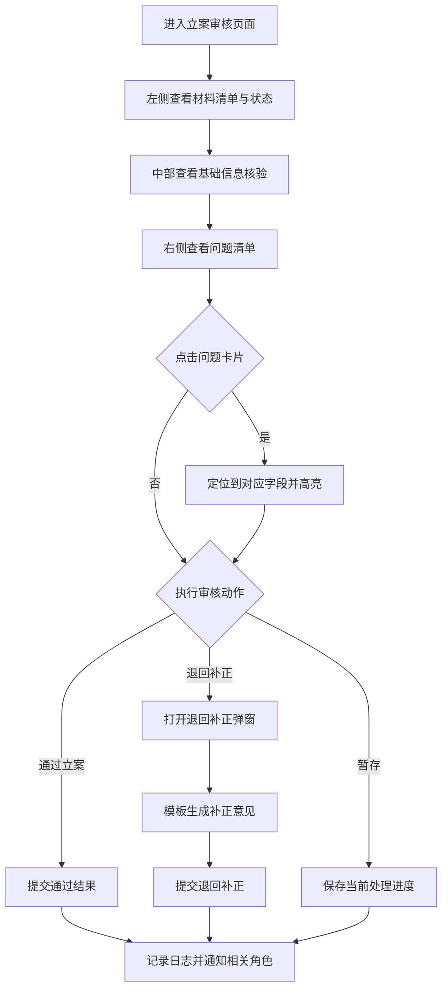

# 立案申请 PRD

## 1. 概述

### 1.1 背景
当前“立案审核”作为仲裁工作台的前置环节，需要将材料完整性核验、字段一致性核验、问题归类处理和审核动作集中到同一页面，减少人工在多页面切换和重复核查。

### 1.2 目标
- 让仲裁员在单页完成“看材料-看规则-看问题-做决策”。
- 支持“通过立案 / 退回补正 / 暂存”三类操作闭环。
- 提升字段核验可解释性：每个字段可见状态、依据来源、风险备注。

### 1.3 业务价值
- 降低立案初审漏检率，提升审核一致性。
- 将经验核验规则结构化沉淀，便于后续规则引擎接入。
- 形成标准化操作留痕，便于复核与追责。

---

## 2. 角色权限

### 2.1 角色定义
| 角色 | 说明 |
|---|---|
| 仲裁员 | 负责立案初审，查看材料、核验字段、处理问题并作出审核决定 |
| 仲裁秘书（扩展） | 可协助整理材料与补正沟通，不具备最终通过权限 |
| 系统管理员（扩展） | 维护规则配置、模板、文案字典与权限策略 |

### 2.2 权限矩阵
| 模块 | 页面可见 | 操作权限 | 数据范围 | 按钮可见 |
|---|---|---|---|---|
| 材料清单 | 仲裁员/秘书 | 预览、查看状态、补传入口 | 当前案件 | 预览、补传 |
| 信息提取核验 | 仲裁员/秘书 | 查看字段状态、查看依据、定位问题 | 当前案件 | 定位、查看证据 |
| 问题清单 | 仲裁员/秘书 | 查看分组、问题定位 | 当前案件 | 定位字段 |
| 审核操作 | 仲裁员 | 通过立案、退回补正、暂存 | 当前案件 | 通过立案、退回补正、暂存 |
| 审核操作 | 秘书 | 仅查看 | 当前案件 | 按钮隐藏或禁用 |

说明：当前页面已实现单角色展示，权限矩阵为本期落地标准，需在接口接入时同步实现按钮级与操作级鉴权。

---

## 3. 流程

### 3.1 状态流转
| 状态 | 触发 | 下一状态 |
|---|---|---|
| 待审核 | 进入页面 | 审核中 |
| 审核中 | 处理问题/定位字段 | 审核中 |
| 审核中 | 通过立案 | 立案通过 |
| 审核中 | 退回补正提交 | 待补正 |
| 审核中 | 暂存 | 审核中（保留草稿） |

### 3.2 通知
- 通过立案：通知案件相关承办角色进入下一环节。
- 退回补正：通知申请方待补正事项与补正意见。
- 暂存：仅站内留痕，不触发外部通知。

---

## 4. 页面设计

## 4.1 页面入口
- 菜单入口：`立案审核`
- 路由入口：`/filing-review`

### 4.2 页面布局
- 左栏：材料清单（材料状态、页数、来源、更新时间、预览/补传）
- 中栏：信息提取核验（字段分组、状态标签、依据来源、规则命中）
- 右栏：问题清单 + 审核操作（通过/退回/暂存）

### 4.3 关键交互
- 问题定位：右栏点击问题项后，中栏自动滚动到目标字段并高亮。
- 证据查看：有证据锚点时可查看来源依据，无锚点时按钮禁用。
- 退回补正：弹窗支持模板生成、意见编辑、提交/取消。

### 4.4 组件级要求
- 列表信息默认提供清晰状态标签（通过/关注/缺失）。
- 长文本采用省略展示并保留完整内容查看能力。
- 空值统一展示为 `-`。

---

## 5. 规则定义

### 5.1 字段模型
字段统一包含以下属性：
- `key`：字段唯一标识
- `label`：字段中文名
- `required`：是否必填
- `editable`：是否可编辑
- `section`：所属分组
- `inputType`：输入类型（text/number/date/select 等）
- `source`：识别来源（申请书/证据等）

### 5.2 字段状态规则
| 状态 | 含义 | 展示要求 |
|---|---|---|
| match | 识别结果与规则一致 | 绿色“通过”标签 |
| risk | 存在疑点或冲突 | 橙色“关注”标签，并展示备注 |
| missing | 必要信息缺失 | 红色“缺失”标签，并进入问题清单 |

### 5.3 问题分类规则
| 分类 | 说明 |
|---|---|
| missing_material | 材料缺失 |
| inconsistent_info | 信息不一致 |
| subject_error | 主体信息异常 |
| claim_error | 请求事项异常 |

### 5.4 规则命中展示
每条规则至少展示：
- 规则标题
- 风险等级
- 判定公式
- 结论说明
- 关联字段

---

## 6. 异常处理

### 6.1 页面态异常
- 空态：无材料/无问题时展示引导文案和下一步建议。
- 权限不足：无审核权限用户进入时展示“仅可查看”或无权限页态。

### 6.2 交互异常
- 重复提交：审核按钮提交后进入 loading + 禁用，防止连点。
- 危险操作确认：通过立案、退回补正提交前增加二次确认。
- 表单校验失败：退回补正文案为空时禁止提交并提示原因。

### 6.3 接口异常
- 提交失败：提示“提交失败，请重试”，支持再次提交。
- 查询失败：展示错误提示并提供“重试”入口。

---

## 7. 文案规范

### 7.1 按钮文案
- 通过立案
- 退回补正
- 暂存
- 模板生成
- 提交
- 取消

### 7.2 提示文案
- 成功：`操作成功`
- 失败：`操作失败，请稍后重试`
- 缺失：`该项信息缺失，请补充后再提交`
- 权限：`当前账号无审核权限`
- 二次确认：`确认执行该操作？执行后将记录审核结论`

### 7.3 空态文案
- 问题清单为空：`暂无待处理问题`
- 材料清单为空：`暂无材料，请先补充上传`
- 依据为空：`暂无可定位证据`

---

## 8. 埋点与日志

### 8.1 埋点事件
| 事件名 | 触发时机 | 关键参数 |
|---|---|---|
| filing_review_page_view | 进入立案审核页 | case_id, user_id, role |
| filing_review_issue_click | 点击问题项 | case_id, issue_id, issue_type, severity |
| filing_review_field_locate | 字段定位成功 | case_id, field_key, from_issue_id |
| filing_review_pass_submit | 点击通过立案提交 | case_id, user_id |
| filing_review_return_submit | 提交退回补正 | case_id, user_id, issue_count |
| filing_review_draft_save | 点击暂存 | case_id, user_id |
| filing_review_template_generate | 点击模板生成 | case_id, issue_count |

### 8.2 操作日志
审核相关动作需记录：
- 操作人、角色、操作时间
- 案件编号
- 操作类型（通过/退回/暂存）
- 操作前后状态
- 退回补正意见正文（如有）

